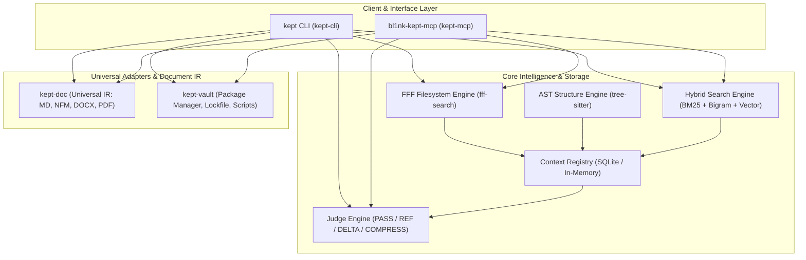

# Implementation Plan

เอกสารแผนยุทธศาสตร์และขั้นตอนการพัฒนาระบบ `bl1nk-kept` (เชื่อมโยงระหว่าง [SPEC.md](SPEC.md) และ [TODO.md](TODO.md))

---

## 1. System Vision & Architecture

`bl1nk-kept` คือ Context Engine และ Vault Package Manager แบบ Local-first สำหรับ AI Coding Agents และ CLI โดยมีแกนหลัก 4 เสา:

1. **Context Intelligence Core:** ตรวจจับและนำเข้า context อย่างประหยัดโทเค็น ด้วยแนวทาง Observation-first ผ่าน `look` (สำรวจ outline) และ `view` (อ่านเนื้อหาจริง)
2. **Context Admission & Judge Engine:** กรองและลด context ซ้ำซ้อนก่อนส่งต่อให้ LLM (`PASS`, `REFERENCE`, `DELTA`, `COMPRESS`)
3. **Retrieval & Document Fidelity:** ระบบค้นหาแบบไฮบริด (BM25 + Thai Bigram Tokenizer + Vector embeddings/reranking) และ Universal Document IR
4. **Vault & Ecosystem:** ตัวจัดการแพ็กเกจ Git สำหรับ vault, lockfile, และ script runtime ที่ปลอดภัย

---

## 2. Phased Implementation Roadmap

ลำดับขั้นตอนการพัฒนาถูกแบ่งออกเป็น 5 เฟสตามเกณฑ์ Gate Conditions ที่เข้มงวด โดยแต่ละ slice ต้องผ่านวงรอบ TDD: Red → Green → Refactor → Proof เสมอ

```mermaid
gantt
    title Phased Implementation Roadmap
    dateFormat  X
    axisFormat %s
    section Phase 0
    Core Hardening & Quality Gate       :p0, 0, 2
    section Phase 1
    Intelligence Core & Admission       :p1, 2, 5
    section Phase 2
    Retrieval & Semantic Search         :p2, 5, 8
    section Phase 3
    Universal Document IR               :p3, 8, 11
    section Phase 4
    Vault & Ecosystem Expansion         :p4, 11, 14
```

### Phase 0: Core Hardening & Quality Gate (Foundations)

*เป้าหมาย: ปิดหนี้การทดสอบและวางแนวป้องกันความปลอดภัยของโค้ดให้มั่นคงก่อนขยายฟีเจอร์*

- **Scope & Deliverables:**
  - เพิ่ม Unit Tests ใน `crate/kept-core/src/policy.rs` ครอบคลุม cascading scope และ naming logic อย่างน้อย 20 กรณีทดสอบ
  - เพิ่ม Unit Tests ใน `crate/kept-core/src/scanner/duplicate.rs` และ `mutation.rs` เพื่อจำลอง execute & rollback แบบฟังก์ชัน
  - ตั้งค่า Restriction Lints (`clippy.toml` / workspace lints) เพื่อตรวจจับและป้องกัน `unwrap()`, `expect()` ใน production code
- **Exit Gate:** `cargo test --workspace` และ `cargo clippy --workspace` ผ่าน 100% โดยไม่มี warning ตกค้าง

### Phase 1: Intelligence Core & Context Admission (P0 Priority)

*เป้าหมาย: สร้างโครงข่ายการดึงข้อมูลและกรอง context ด้วย FFF, AST และ Judge Engine*

- **Scope & Deliverables:**
  - **FFF Engine & Content Grep:** นำ FFF adapter มาครอบคลุมทั้ง file traversal, snapshot และ content grep (`filesystem_grep`, `filesystem_multi_grep`)
  - **Tree-sitter AST Integration:** นำ `tree-sitter` และ `tree-sitter-rust` เข้ามาสกัด structural symbols (`outline`, `symbol://`) แทนที่ regex
  - **Context Admission Pipeline:** ติดตั้ง Judge Engine ใน `crate/kept-core` เพื่อประเมิน diff/token cost และกำหนด treatment (`PASS`, `REFERENCE`, `DELTA`, `COMPRESS`)
  - **Context Registry & State Tracking:** บันทึก session context และ revision changes เพื่อป้องกันการส่งต่อเนื้อหาซ้ำซ้อน
  - **P0.1 Behavioral Waste Gate:** บังคับ `Reference` สำหรับ In-Context Amnesia และ `RequireOutcome` สำหรับ Unproductive Acquisition; ติดตั้ง memoization layer สำหรับ query/path hashes และ track wasted-call metric; เป็น dependency ของ P0.2 และ P0.3
  - **P0.2 Zero-Regression Memory Store:** สร้าง immutable Correction Ledger โดย SQLite เป็น enforcement authority และ Vault/Markdown เป็น append-only audit projection; บังคับ `A ≠ a` ก่อน acquisition หรือ tool dispatch
  - **P0.3 Semantic & Scope Disambiguation:** Router บังคับ intent contract, canonical scope และ `look` ก่อน `view`; ทำ two-tier check (literal rule -> intent congruence); ทำหลัง P0.1 และ P0.2 เพื่อใช้ outcome และ correction evidence เดียวกัน
  - **Cross-Cutting Judge Infra:** เพิ่ม Decision Confidence Score (ไม่ใช่ binary pass/block) และระบบวัด override-rate metric เพื่อป้องกันปัญหา false positive block/warn
  - **Component Benchmark (FFF vs rg):** ทำชุดทดสอบวัด throughput, latency, memory ระหว่าง FFF content grep กับ ripgrep (`rg`) บน cold/warm cache
  - **Design Contract:** รายละเอียด taxonomy, invariant, data contract และ verification อยู่ใน [Cognitive Guardrail Architecture](docs/specs/cognitive_guardrail_architecture.md)
- **Exit Gate:** การอ่านไฟล์ผ่าน `kept inspect` และเครื่องมือ MCP สามารถส่งคืน Treatment ที่ประหยัดโทเค็นได้ถูกต้องตามผลทดสอบ พร้อมมีผลวัด latency เทียบเคียงกับ `rg`; P0.1 → P0.2 → P0.3 บังคับ guardrail ก่อน acquisition/tool dispatch ได้ครบตาม [Cognitive Guardrail Architecture](docs/specs/cognitive_guardrail_architecture.md)

### Phase 2: Retrieval & Semantic Search (P1 Priority)

*เป้าหมาย: ยกระดับการค้นหาเอกสารและโค้ดให้เข้าใจภาษาธรรมชาติและภาษาไทยอย่างแม่นยำ*

- **Scope & Deliverables:**
  - **Thai Tokenizer:** พัฒนาตัวตัดคำภาษาไทยแบบ Bigram / Maximal Matching โดยไม่พึ่งพา runtime ภายนอกที่หนักเกินไป
  - **BM25 Lexical Engine:** สร้าง full-text search index ในเครื่องที่รองรับทั้ง path, filename, และ content
  - **Disk-backed Vector Store & Reranking:** พัฒนาตัวเก็บและค้นหา embedding (เชื่อมโยงกับโมเดลโลคอล) พร้อมกลไก reranking
  - **Unified Retrieval Planner:** ระบบ route query อัตโนมัติ (`exact` → grep, `path` → fuzzy, `concept` → BM25, `semantic` → vector)
- **Exit Gate:** คำสั่ง `kept search` สามารถคืนผลลัพธ์แบบผสมผสาน (Hybrid Score) ได้แม่นยำ รวดเร็ว และคืนค่าในรูปแบบ `Observation` กลาง

### Phase 3: Universal Document IR & Adapters (P1 Priority)

*เป้าหมาย: รองรับการอ่าน ตรวจสอบ และแปลงเอกสารหลากฟอร์แมตเข้าสู่โมเดลกลาง (Universal IR)*

- **Scope & Deliverables:**
  - **Universal IR Core (`kept-doc`):** พัฒนาโครงสร้างข้อมูลกลางสำหรับ Markdown, GFM, และ NFM (Notion Flavored Markdown)
  - **Document Converters:** รองรับการแปลงไป-มาระหว่าง Markdown, DOCX และ HTML
  - **PDF Inspector Adapter:** เพิ่มความสามารถในการตรวจสอบ metadata และโครงสร้างข้อความของไฟล์ PDF (Native Text)
- **Exit Gate:** คำสั่ง `kept doc inspect` และ `kept doc convert` ผ่าน regression test กับชุด fixture เอกสารจริง

### Phase 4: Vault & Ecosystem Expansion (P2 Priority)

*เป้าหมาย: สร้างระบบจัดการแพ็กเกจ vault สคริปต์อัตโนมัติ และการเชื่อมต่อภายนอก*

- **Scope & Deliverables:**
  - **Package Manager (`kept-vault`):** พัฒนาระบบ `kept.toml` manifest, dependency resolver จาก Git repository, และ deterministic `kept.lock`
  - **Secure Script Runtime:** ระบบรันสคริปต์ hook หรือ workflow ใน vault ภายใต้การจำกัดสิทธิ์ (Sandboxing / Resource limits)
  - **Notion Safe Sync:** ตัวประสานข้อมูล (Reconciler) สองทางระหว่าง local markdown กับ Notion workspace แบบปลอดภัย
  - **Interactive TUI:** อินเทอร์เฟซ terminal แบบ interactive สำหรับการสำรวจ context และจัดการ duplicate files
- **Exit Gate:** คำสั่ง `kept install`, `kept run`, และ `kept sync` ใช้งานได้สมบูรณ์และมีตัวอย่าง smoke tests รองรับ

---

## 3. Milestones & Delivery Schedule

| Milestone | Target Deliverables | Priority | Dependent On |
|---|---|---|---|
| **M0: Quality Baseline** | Policy unit tests, scan rollback tests, clippy restriction lints | P0 | - |
| **M1: FFF & AST Core** | FFF engine stabilization, Tree-sitter symbol extraction, Target URI | P0 | M0 |
| **M2: Judge Admission** | ContextRegistry (SQLite), Judge Engine (`PASS`/`REF`/`DELTA`/`COMPRESS`) | P0 | M1 |
| **M3: Hybrid Retrieval** | BM25 indexer, Thai Bigram tokenizer, Vector search integration | P1 | M2 |
| **M4: Document IR** | `kept-doc` Universal IR, Markdown/DOCX/PDF adapters | P1 | M1 |
| **M5: Vault Ecosystem** | `kept-vault` package manager, Git resolver, lockfile, Notion safe sync | P2 | M3, M4 |

---

## 4. Verification & Testing Strategy

การพัฒนาทุกชิ้นต้องเป็นไปตามระเบียบวินัยทางวิศวกรรมที่กำหนดไว้ใน [AGENTS.md](AGENTS.md):

1. **Test-Driven Development (TDD):**
   - เขียน failing test ใน `tests/` หรือ sub-module unit test เพื่อระบุพฤติกรรมที่ต้องการก่อนลงมือแก้โค้ด
   - ปรับปรุงโค้ดขั้นต่ำเพื่อให้ test ผ่าน (Minimal implementation)
2. **Quality Checks:**
   - รัน `cargo check --workspace` เพื่อยืนยันความถูกต้องของ types
   - รัน `cargo test --workspace` เพื่อยืนยันว่าไม่มี regression
   - รัน `tools/check_markdown_links.py` เพื่อตรวจสอบลิงก์ในเอกสาร
3. **Pre-commit Gate:**
   - ทุก commit ต้องผ่านสคริปต์ [tools/pre_commit_hook.py](tools/pre_commit_hook.py) ภายในเวลาไม่เกิน 1 วินาที

---

## 5. Pending Architectural Decisions

ประเด็นทางเทคนิคที่อยู่ระหว่างการวิจัยและรอการสรุปเป็น ADR ก่อนเริ่ม implementation จริง:

### Evidence System

| Issue Under Investigation | Required Information Before Decision | Impacted Area |
|---|---|---|
| Schema and storage location for run manifest | การรันซ้ำจริง 1 รอบ, การ replay 1 ครั้ง และตัวอย่าง correction | replay, rescore, comparable gain |
| Marker syntax and supported source locations | ตัวอย่าง Rust/Markdown/HTML/PDF พร้อม sidecar locator | debt ledger, source annotation |
| Command contract for `inspect`, `debt`, `gain` | TDD command contract และโครงสร้างไดเรกทอรี evidence | CLI surface (`kept-cli`) |
| Gold corpus allocation | แหล่งข้อมูล public/licensed และ provenance rules | 10K review corpus |
| Review process for conflicting reviews | Review batch ที่มี accepted/rejected/uncertain จริง | dictionary materialization |
| Baseline retention & correction record schema | สถานการณ์ผลถูก supersede พร้อม run ที่ comparable/incomparable | gain scoreboard |

### PDF Adapter

| Issue Under Investigation | Required Information Before Decision | Impacted Area |
|---|---|---|
| Version, license, and Cargo feature graph for `pdf-inspector` | การตรวจสอบ dependency audit ของ release ที่เลือก | adapter dependency declaration |
| Source metadata schema in Universal IR | Fixture ที่ backward-compatible และ conversion round-trip | document model migration |
| Public PDF test fixtures | ชุดไฟล์ PDF native-text, scanned, mixed, malformed | acceptance tests (`kept-doc`) |
| Local OCR engine & model policy | Checksum, cache, resource limit และความยินยอมจากผู้ใช้ | optional OCR workflow |
| CLI output format | Inspection/report review พร้อม page diagnostics | `kept doc inspect-pdf` |

### Benchmark Expansion

| Issue Under Investigation | Required Information Before Decision | Impacted Area |
|---|---|---|
| Search workload and relevance fixtures | Workload distribution จริงที่ anonymize แล้ว หรือ public corpus | recall และ latency measurement |
| Repetitions, warm-up, and environment policy | ผลการรัน trial run บนเครื่องทดสอบที่รองรับ | release comparison metadata |
| Presentation format when changing defaults | Baseline/candidate run ที่ comparable ครบชุด | release notes และเอกสารกำกับ |

---

## 6. Decision Closure Protocol

เมื่อมีข้อมูลการทดลองและขอบเขต implementation ครบถ้วนตามตารางข้างต้น ให้ปฏิบัติดังนี้:
1. สร้าง ADR ฉบับใหม่ในไดเรกทอรี `docs/adr/` บันทึกการตัดสินใจและเหตุผล
2. นำรายการออกจากตาราง Pending Architectural Decisions
3. แตกงานเป็น Checkbox ระดับ behavior ใน [TODO.md](TODO.md) และปรับปรุง [SPEC.md](SPEC.md)
